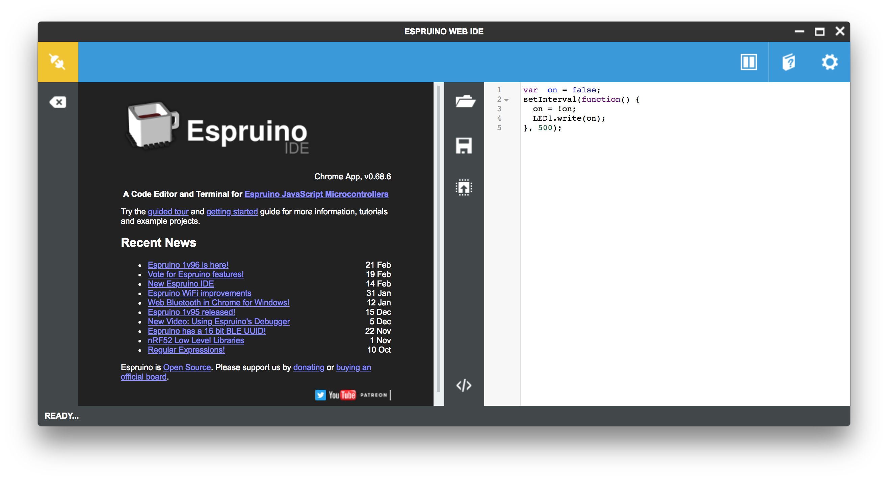
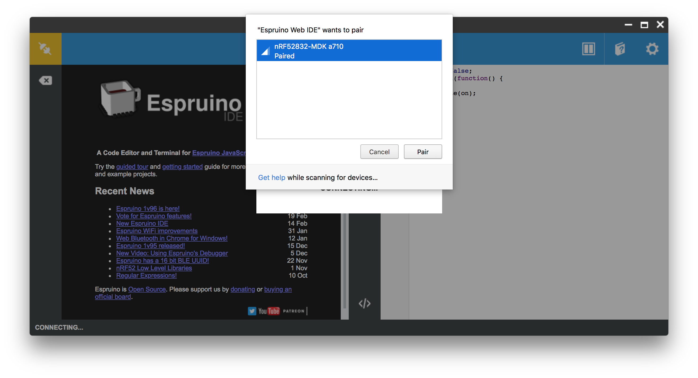

# Espruino<br><small>运行在内存和存储都极其有限的 MCU 上的 JavaScrupt 引擎</small>

[](https://github.com/espruino/Espruino)

## 简介

Espruino 是一个非常轻量的 JavaScript 引擎，可以运行在 128KB Flash & 8KB RAM 的微控制器 (MCU) 上。

相比于其他 JavaScript 引擎，Espruino 具有以下特点：

* 轻量级 —— 可以运行在 128KB Flash & 8KB RAM 的微控制器 (MCU) 上；
* 事件驱动 —— 与 node.js 类似，Espruino 采用事件驱动机制，支持异步函数回调和异步 I/O；
* 简单易用 —— Espruino 提供丰富的外设库，对硬件层做了很好的抽象，只要会写 JavaScript 就能用它来控制硬件；
* 跨平台开发 —— Espruino 提供一个基于 Chrome 浏览的 Web IDE，可以进行跨平台开发；
* 无线调试 —— Espruino Web IDE 使用 Web Bluetooth API，可以提供无线下载调试 JavaScript 代码功能。



了解更多内容，可以访问 [Espruino 官网](http://www.espruino.com/)。

## 快速入门

下面内容将介绍如何在 nRF52832-MDK 上运行使用 Espruino。

### 下载 Espruino 固件

我们已经为 nRF52832-MDK 提供了 Espruino 固件，固件以 `espruino_x.x_nrf52832_mdk.hex` 方式命名，位于 `./nrf52832-mdk/firmware/espruino/` 目录。

连接 nRF52832-MDK，直接将该固件拖动到 **DAPLINK** 可移动磁盘即可完成下载：


### 安装 Espruino Web IDE

Espruino 官方提供了 IDE，开发起来非常方便，这里推荐使用 Chrome Web App，安装步骤如下：

1. 安装 [Chrome 浏览器](https://www.google.com/intl/en/chrome/)；
2. 安装 [Espruino Web IDE](https://chrome.google.com/webstore/detail/espruino-web-ide/bleoifhkdalbjfbobjackfdifdneehpo) 应用；
3. 在浏览器标签栏打开 <kbd>应用</kbd> 图标可发现 Espruino Web IDE 应用

### 连接 nRF52832-MDK

现在，你可以开始在 Espruino Web IDE 上连接 nRF52832-MDK，点击 IDE 左上角<kbd>连接</kbd>图标，选择 *Web Bluetooth* 或串口进行连接：


对于 *Web Bluetooth* 连接，需要先配对：



成功连接，IDE 会有状态提示：

 

### 运行你的代码

连接成功后，设备即进入 REPL 模式，可以在左边窗口输入一些 JavaScript 代码：

``` sh
> 1+1

> digitalWrite(LED1,1)

> digitalWrite(LED1,0)
```

也可以在右边代码编辑器窗口输入 JavaScript 代码，点击<kbd>上传</kbd>即可自动加载脚本：

``` javascript
var  on = false;
setInterval(function() {
  on = !on;
  LED1.write(on);
}, 500);
```


整个过程就是这样，接下来你可以查阅 Espruino 的相关 API，编写更有趣的应用。

## 无线更新 Espruino 固件

除了前面介绍的“拖放”下载 Espruino 固件，我们还可以通过无线 DFU 的方式进行固件更新，具体步骤如下：

1. 打开 Chrome 浏览器，前往 [Web Bluetooth Secure DFU](https://thegecko.github.io/web-bluetooth-dfu/examples/web.html) 页面；

2. 先将 nRF52832-MDK 上的 `P18` 与 `3V3` 引脚短接，再上电，红蓝灯一起亮，断开 `P18` 与 `3V3`，蓝色灯亮，此时设备即进入 DFU 模式；

3. 在浏览器页面选择相关固件包，固件位于 [nrf52832-mdk/firmware/espruino/](https://github.com/makerdiary/nrf52832-mdk/tree/master/firmware/espruino)，以 `espruino_x.x_nrf52832_mdk.zip` 方式命名；

4. 连接名为 `DfuTarg` 的设备，等待更新完成即可，如果中途不慎中断，重复以上步骤即可。


## 如何编译 Espruino？

这部分内容将介绍如何自己动手编译 Espruino，以 macOS 系统为例，其他平台大同小异，可以自行摸索。

### 搭建编译环境

下载安装 GNU Arm Embedded toolchains，并确保添加到系统环境变量：

``` sh
<path to install directory>/gcc-arm-none-eabi-6-2017-q1-update/bin
```

验证是否正确安装：

``` sh
$ arm-none-eabi-gcc --version
```

!!! note "注意"
    最新版 GNU Arm Embedded toolchains 可能无法正常工作，可以自行尝试。

### 支持 nRF52832-MDK

首先，克隆 Espruino 源码到本地：

``` sh
$ git clone https://github.com/espruino/Espruino.git
```

为了支持 nRF52832-MDK 硬件，需要在 `./Espruino/boards/` 目录添加 `NRF52832_MDK.py` 文件，内容如下：

``` python
import pinutils;

info = {
 'name' : "nRF52832-MDK",
 'link' :  [ "https://wiki.makerdiary.com/nrf52832-mdk/" ],
  # This is the nRF52832-MDK
 'default_console' : "EV_SERIAL1",
 'default_console_tx' : "D20",
 'default_console_rx' : "D19",
 'default_console_baudrate' : "9600",
 'variables' : 2250, # How many variables are allocated for Espruino to use. RAM will be overflowed if this number is too high and code won't compile.
 'bootloader' : 1,
 'binary_name' : 'espruino_%v_nrf52832_mdk.hex',
 'build' : {
   'optimizeflags' : '-Os',
   'libraries' : [
     'BLUETOOTH',
     'NET',
     'GRAPHICS',
     'CRYPTO',
     'NFC',
     'NEOPIXEL'
   ],
   'makefile' : [
     'DEFINES+=-DHAL_NFC_ENGINEERING_BC_FTPAN_WORKAROUND=1', # Looks like proper production nRF52s had this issue
     'DEFINES+=-DCONFIG_GPIO_AS_PINRESET', # Allow the reset pin to work
     'DEFINES+=-DBLUETOOTH_NAME_PREFIX=\'"nRF52832-MDK"\'',
     'DFU_PRIVATE_KEY=targets/nrf5x_dfu/dfu_private_key.pem',
     'DFU_SETTINGS=--application-version 0xff --hw-version 52 --sd-req 0x8C'
   ]
 }
};

chip = {
  'part' : "NRF52832",
  'family' : "NRF52",
  'package' : "QFN48",
  'ram' : 64,
  'flash' : 512,
  'speed' : 64,
  'usart' : 1,
  'spi' : 3,
  'i2c' : 2,
  'adc' : 1,
  'dac' : 0,
  'saved_code' : {
    'address' : ((118 - 10) * 4096), # Bootloader takes pages 120-127, FS takes 118-119
    'page_size' : 4096,
    'pages' : 10,
    'flash_available' : 512 - ((31 + 8 + 2 + 10)*4) # Softdevice uses 31 pages of flash, bootloader 8, FS 2, code 10. Each page is 4 kb.
  },
};

devices = {
  'BTN1' : { 'pin' : 'D18', 'pinstate' : 'IN_PULLDOWN' }, # Pin negated in software
  'LED1' : { 'pin' : 'D22', 'inverted' : False }, # Pin negated in software
  'LED2' : { 'pin' : 'D23', 'inverted' : False }, # Pin negated in software
  'LED3' : { 'pin' : 'D24', 'inverted' : False }, # Pin negated in software
  'RX_PIN_NUMBER' : { 'pin' : 'D19'},
  'TX_PIN_NUMBER' : { 'pin' : 'D20'},
  'CTS_PIN_NUMBER' : { 'pin' : 'D7'},
  'RTS_PIN_NUMBER' : { 'pin' : 'D5'},
  # Pin D22 is used for clock when driving neopixels - as not specifying a pin seems to break things
};

# left-right, or top-bottom order
board = {
  'left' : [ 'VIN', '5V', 'GND', 'PD4','PD5','PD6','PD7','PD8','PD9','PD10','PD11','PD12','PD13','PD14','PD15','PD16','PD17','PD18'],
  'right' : [ '3V3', 'GND', 'RST', 'CLK', 'DIO','TDO','TDI', 'TXD','RXD','PD3','PD2','PD31','PD30','PD29','PD28','PD27','PD26','PD25'],
};
board["_css"] = """
""";

def get_pins():
  pins = pinutils.generate_pins(0,31) # 32 General Purpose I/O Pins.
  pinutils.findpin(pins, "PD0", True)["functions"]["XL1"]=0;
  pinutils.findpin(pins, "PD1", True)["functions"]["XL2"]=0;
  pinutils.findpin(pins, "PD5", True)["functions"]["3.3"]=0;
  pinutils.findpin(pins, "PD6", True)["functions"]["3.3"]=0;
  pinutils.findpin(pins, "PD7", True)["functions"]["3.3"]=0;
  pinutils.findpin(pins, "PD8", True)["functions"]["3.3"]=0;
  pinutils.findpin(pins, "PD9", True)["functions"]["NFC1"]=0;
  pinutils.findpin(pins, "PD10", True)["functions"]["NFC2"]=0;
  pinutils.findpin(pins, "PD13", True)["functions"]["3.3"]=0;
  pinutils.findpin(pins, "PD14", True)["functions"]["3.3"]=0;
  pinutils.findpin(pins, "PD15", True)["functions"]["3.3"]=0;
  pinutils.findpin(pins, "PD16", True)["functions"]["3.3"]=0;
  pinutils.findpin(pins, "PD17", True)["functions"]["3.3"]=0;
  pinutils.findpin(pins, "PD18", True)["functions"]["3.3"]=0;
  pinutils.findpin(pins, "PD19", True)["functions"]["RXD"]=0;
  pinutils.findpin(pins, "PD20", True)["functions"]["TXD"]=0;
  pinutils.findpin(pins, "PD22", True)["functions"]["LED_1"]=0;
  pinutils.findpin(pins, "PD23", True)["functions"]["LED_2"]=0;
  pinutils.findpin(pins, "PD24", True)["functions"]["LED_3"]=0;
  pinutils.findpin(pins, "PD2", True)["functions"]["ADC1_IN0"]=0;
  pinutils.findpin(pins, "PD3", True)["functions"]["ADC1_IN1"]=0;
  pinutils.findpin(pins, "PD4", True)["functions"]["ADC1_IN2"]=0;
  pinutils.findpin(pins, "PD5", True)["functions"]["ADC1_IN3"]=0;
  pinutils.findpin(pins, "PD28", True)["functions"]["ADC1_IN4"]=0;
  pinutils.findpin(pins, "PD29", True)["functions"]["ADC1_IN5"]=0;
  pinutils.findpin(pins, "PD30", True)["functions"]["ADC1_IN6"]=0;
  pinutils.findpin(pins, "PD31", True)["functions"]["ADC1_IN7"]=0;
  # everything is non-5v tolerant
  for pin in pins:
    pin["functions"]["3.3"]=0;
  #The boot/reset button will function as a reset button in normal operation. Pin reset on PD21 needs to be enabled on the nRF52832 device for this to work.
  return pins
```

你也可以直接克隆我们修改好的仓库：

``` sh
$ git clone https://github.com/makerdiary/Espruino.git
```

### 编译 Espruino 固件

现在可以开始编译 Espruino，打开命令行终端，切换到 Espruino 目录：

``` sh
$ cd <Espruino git clone location>/Espruino
```

直接运行以下命令，可以编译完整固件，将生成 `.hex` 文件：

``` sh
$ make clean && BOARD=NRF52832_MDK RELEASE=1 make
```

运行以下命令，可以编译 DFU 固件，将生成 `.zip` 文件：

``` sh
$ make clean && DFU_UPDATE_BUILD=1 BOARD=NRF52832_MDK RELEASE=1 make
```

## 参考资源

* [Espruino 官网](http://www.espruino.com/)
* [Espruino API 文档](http://www.espruino.com/Reference#software)
* [Espruino 模块](http://www.espruino.com/Modules)
* [Espruino 官方仓库](https://github.com/espruino/Espruino)
* [makerdiary/Espruino](https://github.com/makerdiary/Espruino)

## 问题反馈

如果在开发过程遇到任何问题，可以通过 [GitHub Issue](https://github.com/makerdiary/nrf52832-mdk/issues) 反馈。

<a href="https://github.com/makerdiary/nrf52832-mdk/issues/new"><button data-md-color-primary="marsala"><i class="fa fa-github"></i> 创建 Issue</button></a>

