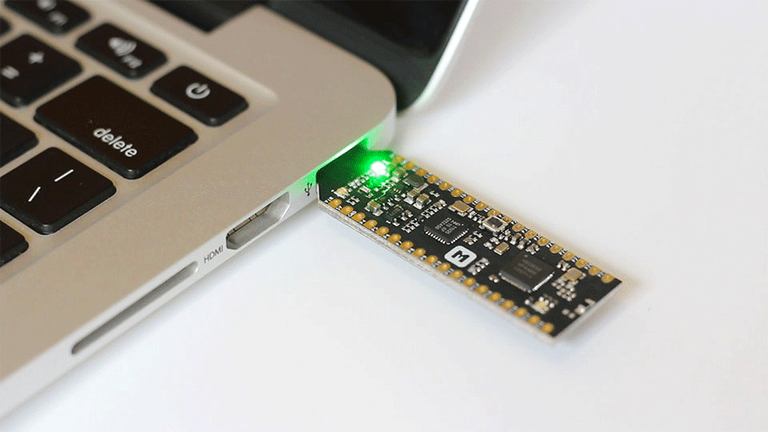

# Arm Mbed OS <br><small>Arm 开源、面向物联网小型设备的实时操作系统</small>

## 简介

Arm Mbed OS 是 Arm 专门为物联网设备而设计的开源嵌入式操作系统，主要面向 ARM Cortex-M 系列微控制器，非常适合涉及智能城市、智能家庭和穿戴式设备等领域的应用程序。

相比于其他嵌入式操作系统，Arm Mbed OS 的主要优势在于：

* 安全性：提供 mbed TLS 和 mbed uVisor 安全机制
* 连接性：支持多种协议栈，包括 Bluetooth LE, Wi-Fi, 6LoWPAN, Thread, Lora等等
* 完整的工具链支持：提供在线 IDE, mbed CLI 以及 第三方 IDE
* 良好的社区生态

## 使用 Arm Mbed CLI

Arm 为 Mbed OS 提供了离线开发工具 Mbed CLI，该工具支持跨平台，可以运行在 Windows，Linux 和 macOS 平台上。

在 Windows 上，最简单的方法是使用 [Mbed CLI Windows .exe 安装包](https://mbed-media.mbed.com/filer_public/7f/46/7f46e205-52f5-48e2-be64-8f30d52f6d75/mbed_installer_v041.exe)。

在 Linux 和 macOS系统，可以使用 `pip` 进行安装：

``` sh
$ pip install mbed-cli
```

安装完成后，可以使用 `mbed help` 验证是否正确安装。

接着，需要添加工具链路径配置：

``` sh
$ mbed config -G GCC_ARM_PATH "<path to GNU Arm bin>"
[mbed] <path to GNU Arm bin> now set as global GCC_ARM_PATH

$ mbed config --list
[mbed] Global config:
GCC_ARM_PATH=<path to GNU Arm bin>
```

## 支持 nRF52832-MDK

首先，从 Arm Mbed 官方仓库克隆 Mbed OS 源码：

``` sh
$ git clone https://github.com/ARMmbed/mbed-os.git
```

在 `mbed-os\targets\targets.json` 文件中添加以下目标描述：

``` json
	"NRF52832_MDK": {
	    "inherits": ["MCU_NRF52"],
	    "macros_add": ["BOARD_PCA10040", "NRF52_PAN_12", "NRF52_PAN_15", "NRF52_PAN_58", "NRF52_PAN_55", "NRF52_PAN_54", "NRF52_PAN_31", "NRF52_PAN_30", "NRF52_PAN_51", "NRF52_PAN_36", "NRF52_PAN_53", "S132", "CONFIG_GPIO_AS_PINRESET", "BLE_STACK_SUPPORT_REQD", "SWI_DISABLE0", "NRF52_PAN_20", "NRF52_PAN_64", "NRF52_PAN_62", "NRF52_PAN_63"],
	    "device_has_add": ["ANALOGIN", "I2C", "I2C_ASYNCH", "INTERRUPTIN", "LOWPOWERTIMER", "PORTIN", "PORTINOUT", "PORTOUT", "PWMOUT", "RTC", "SERIAL", "SERIAL_ASYNCH", "SERIAL_FC", "SLEEP", "SPI", "SPI_ASYNCH", "SPISLAVE", "FLASH"],
	    "release_versions": ["2", "5"],
	    "device_name": "nRF52832_xxAA"
	},
```

另外需要在 `mbed-os/targets/TARGET_NORDIC/TARGET_NRF5/TARGET_MCU_NRF52832/TARGET_NRF52832_MDK/` 增加 `PinNames.h` 和 `device.h` 文件：

``` c
// PinNames.h

#ifndef MBED_PINNAMES_H
#define MBED_PINNAMES_H

#include "cmsis.h"

#ifdef __cplusplus
extern "C" {
#endif

typedef enum {
    PIN_INPUT,
    PIN_OUTPUT
} PinDirection;

#define PORT_SHIFT  3

typedef enum {
    p0  = 0,
    p1  = 1,
    p2  = 2,
    p3  = 3,
    p4  = 4,
    p5  = 5,
    p6  = 6,
    p7  = 7,
    p8  = 8,
    p9  = 9,
    p10 = 10,
    p11 = 11,
    p12 = 12,
    p13 = 13,
    p14 = 14,
    p15 = 15,
    p16 = 16,
    p17 = 17,
    p18 = 18,
    p19 = 19,
    p20 = 20,
    p21 = 21,
    p22 = 22,
    p23 = 23,
    p24 = 24,
    p25 = 25,
    p26 = 26,
    p27 = 27,
    p28 = 28,
    p29 = 29,
    p30 = 30,
    p31 = 31,
    // Not connected
    NC = (int)0xFFFFFFFF,

    LED1    = p22,
    LED2    = p23,
    LED3    = p24,

    BUTTON1 = p18,

    RX_PIN_NUMBER  = p19,
    TX_PIN_NUMBER  = p20,
    CTS_PIN_NUMBER = NC,   // not connected
    RTS_PIN_NUMBER = NC,   // not connected

    // mBed interface Pins
    USBTX = TX_PIN_NUMBER,
    USBRX = RX_PIN_NUMBER

} PinName;

typedef enum {
    PullNone = 0,
    PullDown = 1,
    PullUp = 3,
    PullDefault = PullUp
} PinMode;

#ifdef __cplusplus
}
#endif

#endif
```

``` c
// device.h

#ifndef MBED_DEVICE_H
#define MBED_DEVICE_H

#include "objects.h"

#endif
```

最后，需要提交修改：

``` sh
$ git add *
$ git commit -m "add support for nRF52832-MDK"
```

## 编译运行第一个示例

现在可以开始尝试编译第一个示例，这里以 `mbed-os-example-blinky` 为例：

打开命令行终端，切换到示例目录：

``` sh
$ cd ./nrf52832-mdk/examples/mbedos5/mbed-os-example-blinky/
```

为该示例添加 Mbed OS 库：

``` sh
mbed-os-example-blinky$ mbed add <path to mbed-os repository>
```

使用 `mbed compile` 进行编译：

``` sh
mbed-os-example-blinky$ mbed compile --target NRF52832_MDK --toolchain GCC_ARM --flash
```

如果增加 `--flash` 参数，将会在编译完成后自动将固件下载到 nRF52832-MDK 硬件上。如果 `mbed detect` 无法检测到板子，可以运行以下命令添加：

``` sh
$ mbedls --mock=1024:nRF52832-MDK
```





## 低功耗蓝牙示例

Mbed OS 对低功耗蓝牙支持非常友好，这里提供一些低功耗蓝牙示例：

``` sh
./nrf52832-mdk/examples/mbedos5/mbed-os-example-ble
├── BLE_BatteryLevel
├── BLE_Beacon
├── BLE_Button
├── BLE_EddystoneObserver
├── BLE_EddystoneService
├── BLE_GAPButton
├── BLE_HeartRate
├── BLE_LED
├── BLE_LEDBlinker
├── BLE_Thermometer
└── README.md
```

可以切换到示例目录，例如，`BLE_BatteryLevel`:

``` sh
$ cd BLE_BatteryLevel
```

添加 Mbed OS 库：

``` sh
BLE_BatteryLevel$ mbed add <path to mbed-os repository>
```

编译下载：

``` sh
BLE_BatteryLevel$ mbed compile --target NRF52832_MDK --toolchain GCC_ARM --flash
```

打开 **nRF Connect** app，找到名为 `BATTERY` 的设备，连接设备，可发现 UUID 为 `0x180F` 的电池服务，该服务包含 UUID 为 `0x2A19` 的 `Battery level` 属性。


其他低功耗蓝牙示例使用方法类似，你可以自行验证。

## 更多示例

我们会不定期增加更多有趣的示例到 [nrf52832-mdk](https://github.com/makerdiary/nrf52832-mdk) 仓库中，敬请关注！

## 参考资源

* [Arm Mbed OS 开发者网站](https://os.mbed.com/)
* [Mbed OS 文档中心](https://os.mbed.com/docs/)
* [ARMmbed/mbed-os 仓库](https://github.com/ARMmbed/mbed-os)

## 问题反馈

如果在开发过程遇到任何问题，可以通过 [GitHub Issue](https://github.com/makerdiary/nrf52832-mdk/issues) 或 [Slack](https://join.slack.com/t/makerdiary/shared_invite/enQtMzIxNTA4MjkwMjc2LTM5MzcyNDhjYjI3YjEwOWE1YzM3YmE0YWEzNGNkNDU3NmE5M2M0MWYyM2QzZTFkNzQ2YjdmMWJlZjIwYmQwMDk) 反馈。

<a href="https://github.com/makerdiary/nrf52832-mdk/issues/new"><button data-md-color-primary="indigo"><i class="fa fa-github"></i> 创建 Issue</button></a>

<a href="https://join.slack.com/t/makerdiary/shared_invite/enQtMzIxNTA4MjkwMjc2LTM5MzcyNDhjYjI3YjEwOWE1YzM3YmE0YWEzNGNkNDU3NmE5M2M0MWYyM2QzZTFkNzQ2YjdmMWJlZjIwYmQwMDk"><button data-md-color-primary="red"><i class="fa fa-slack"></i> 加入 Slack</button></a>

