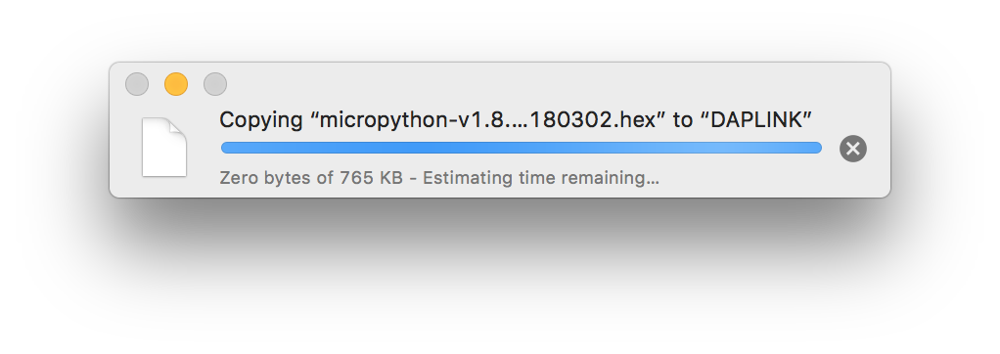

# MicoPython <br><small>面向嵌入式设备的轻量级 Python</small>

[](https://github.com/micropython/micropython)

## 简介

MicroPython 是⼀个 Python 3 的精简、⾼效实现，包含 Python 标准库的⼀⼩部分，并经过优化，可以运⾏在微控制器和受限环境中运⾏。

MicroPython 包含了诸如交互式提⽰，任意精度整数、闭包、列表解析、⽣成器、异常处理等⾼级功能。然⽽，它⾜够紧凑，适合并能运⾏在只有 256k 代码空间和 16K RAM 的硬件上。

MicroPython 旨在尽可能与普通 Python 兼容，从⽽轻松将代码从桌⾯传输到微控制器或嵌⼊式系统。

引用 MicroPhthon 社区的一段话：

``` markdown
Code,
Hack it,
Less is more,
Keep it simple,
Small is beautiful,
Be brave! Break things! Learn and have fun!
Express yourself with MicroPython.
Happy hacking! :-)
```

了解更多信息，可以访问 [MicroPython 官方网站](http://micropython.org/)。

## 快速入门

下面内容我们简单介绍如何在 nRF52832-MDK 上运行 MicroPython。

### 下载 MicroPython 固件

我们已经提供一个简单的 MicroPython 固件，位于 `./nrf52832-mdk/firmware/micropython/` 目录下。

连接板子，直接将 `.hex` 固件拖到 *DAPLINK* 可移动磁盘中：



下载完成，按下 RESET 按钮，MicroPython 将以 REPL 模式运行。

### 运行第一行代码

使用串口工具，打开设备，波特率为 `115200`：

``` sh
$ screen /dev/cu.usbmodem1412 115200
``` 

试着运行一些 Python 代码：

``` python
>>> print('hello micropython!')
```

输入 `help()` 可以获取一些有用的帮助信息：


### Blink LED 示例

MicroPython 固件已经提供一些可以操作外设的 API，这里我们可以 Blink LED 为例：

``` python
from machine import Pin
import time

led = Pin('PA22', Pin.OUT)

for i in range(0, 10):
    led.value(1)
    time.sleep_ms(500)
    led.value(0)
    time.sleep_ms(500)

print('Done!')
```

观察绿色 LED 是否闪烁。

这就是整个使用过程，可以参考官方 API 文档，体验更多功能。

## 如何编译 MicroPython?

以下内容将介绍如何自己动手编译 MicroPython。

### 搭建开发环境

首先，下载安装 GNU Arm Embedded toolchains，并确保添加到系统环境变量：

``` sh
<path to install directory>/gcc-arm-none-eabi-6-2017-q2-update/bin
```

验证是否正确安装：

``` sh
$ arm-none-eabi-gcc --version
```

!!! note "注意"
    最新版 GNU Arm Embedded toolchains 可能无法正常工作，可以自行尝试。

### 编译并下载 MicroPython

从我们的仓库克隆支持 nRF52832-MDK 的 MicroPython 仓库，并编译 MicroPython 标准库：

``` sh
$ git clone https://github.com/makerdiary/micropython.git
$ cd micropython
$ git submodule update --init
$ make -C mpy-cross
```

切换到 `nrf` 目录，下载 低功耗蓝牙协议栈：

``` sh
micropython$ cd nrf
nrf$ ./drivers/bluetooth/download_ble_stack.sh
```

接着，可以为 nRF52832-MDK 编译并下载固件：

``` sh
$ make BOARD=nrf52832_mdk SD=s132 sd FLASHER=pyocd
```

### 项目状态

目前，这部分工作还处于 beta 阶段，部分 API 可能会变更，你也可以参与到这个项目中来，尽管折腾吧。

## 参考资源

* [MicroPython 官方网站](http://micropython.org/)
* [MicroPython 文档](http://docs.micropython.org/en/latest/pyboard/index.html)
* [MicroPython 官方仓库](https://github.com/micropython/micropython)
* [makerdiary/MicroPython](https://github.com/makerdiary/micropython)

## 问题反馈

如果在开发过程遇到任何问题，可以通过 [GitHub Issue](https://github.com/makerdiary/nrf52832-mdk/issues) 反馈。

<a href="https://github.com/makerdiary/nrf52832-mdk/issues/new"><button data-md-color-primary="marsala"><i class="fa fa-github"></i> 创建 Issue</button></a>

