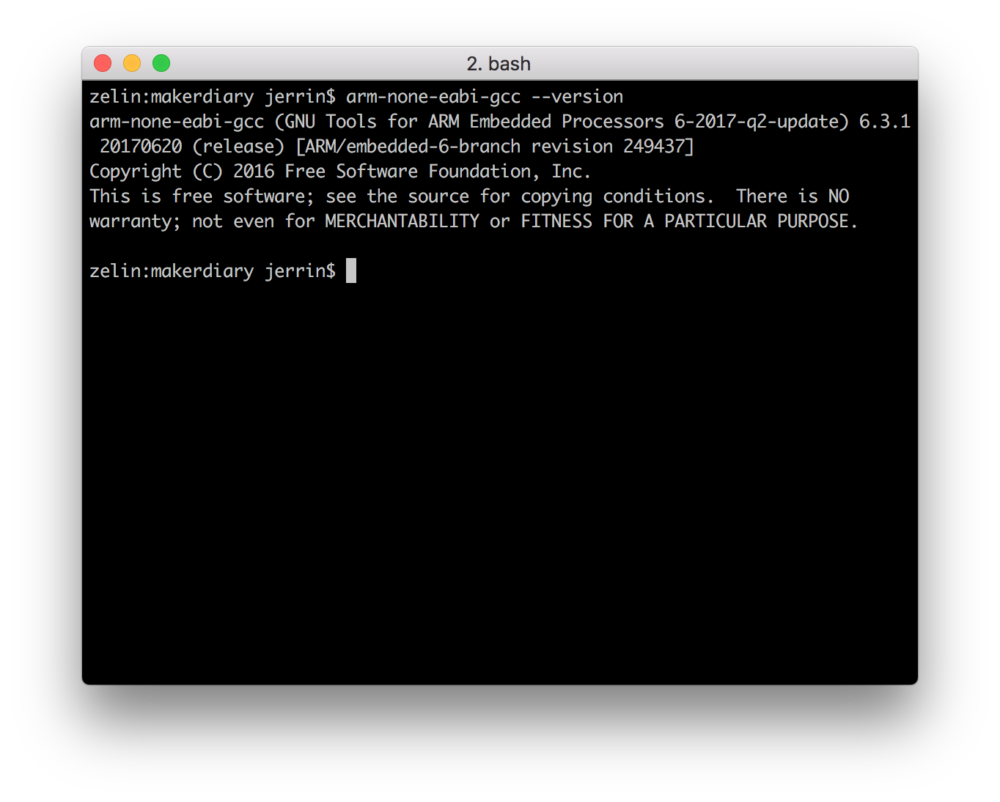
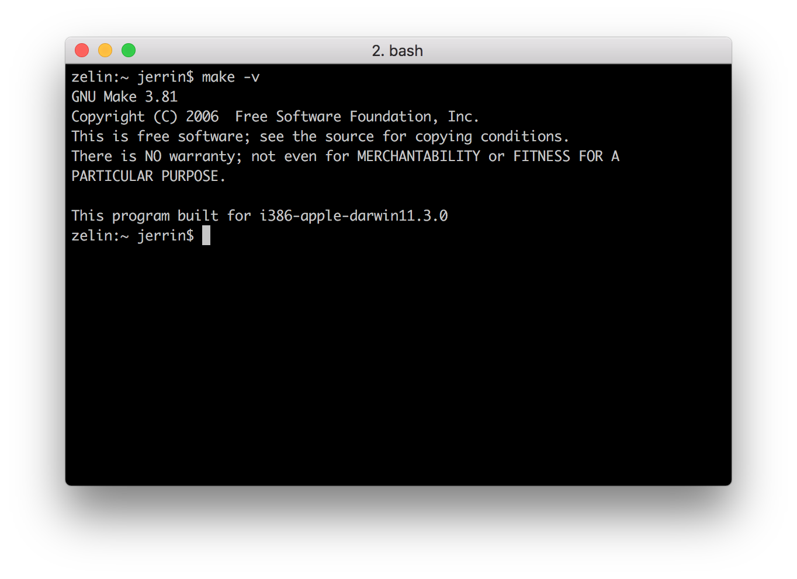
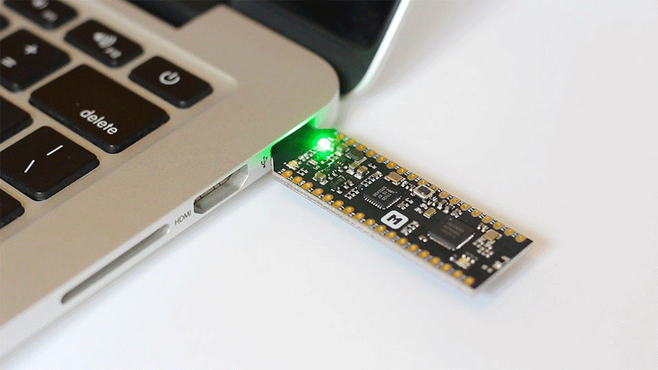

# nRF5 SDK <br><small>Nordic 官方针对 nRF5x 系列 SoC 的软件开发包</small>

[](http://www.nordicsemi.com/eng/Products/Bluetooth-low-energy/nRF5-SDK)

## 简介

nRF5 SDK 是 Nordic 针对 nRF5x 系列芯片提供的软件开发环境，包含各种外设驱动、代码库、应用示例、低功耗蓝牙协议栈以及其他具有专利的无线协议栈。

nRF5 SDK 以 `.zip` 压缩包的形式发布，这样可以便于开发者自由选择开发环境。

我们已经为 nRF52832-MDK 提供了一些简单的示例，确保能够利用 nRF5 SDK 快速开发你自己的应用。

在此之前，你需要搭建一个基本的开发环境，推荐使用 GNU Arm Embedded Toolchains。

## 搭建开发环境

你可以按照以下步骤搭建开发环境，对于不同操作系统，方法大同小异，可以自行摸索。

### 安装 GNU Arm Embedded Toolchain

GNU Arm Embedded Toolchain 是 Arm 公司提供的 GNU 开源工具链，集成 GCC 交叉编译器、标准库以及其他实用工具，使开发者能够轻松开发基于 Arm Cortex-M 和 Cortex-R 的软件。该工具支持跨平台，可以运行在 Windows，Linux 和 macOS 平台上。

你可以通过以下链接下载该工具链：

<a href="https://developer.arm.com/open-source/gnu-toolchain/gnu-rm/downloads"><button data-md-color-primary="marsala">点击下载</button></a>

下载、安装 `6-2017-q2-update` 版本，并将工具链的目录添加到系统环境变量中：

``` sh
# in ~/.bash_profile, add the following script
export PATH="<path to install directory>/gcc-arm-none-eabi-6-2017-q2-update/bin:${PATH}"
```

可通过以下命令验证是否安装成功：

``` sh
$ arm-none-eabi-gcc --version
```



### 安装 GNU make

nRF5 SDK 依赖于 makefile 的方式，因此需要 [GNU make](https://www.gnu.org/software/make/) 工具来处理 makefile。

在 Windows 平台，最简单的方式是安装一个 Unix 开发环境，例如 [MSYS2](http://www.msys2.org/)。你可以按照以下步骤进行配置：

1. 前往 [MSYS2](http://www.msys2.org/) 官网下载软件并安装（64 位系统选择 "x86_64"，32 位系统选择 "i686"）；

2. 打开 MSYS2，更新系统软件包：

	``` sh
	$ pacman -Syu
	```

3. 如果需要的话，关闭 MSYS2，重新运行以完成更新：

	``` sh
	$ pacman -Su
	```

4. 安装 `git`、`make`、`python2`等工具：

	``` sh
	$ pacman -S git make python2
	```

Linux 和 macOS 系统一般自带 `make` 工具，可以通过 `make -v` 命令查看该工具是否可用。对于某些 Linux 发行版可能需要另行安装，例如在 Ubuntu 系统可以通过以下命令安装：

``` sh
$ sudo apt-get install build-essential checkinstall
```



### 安装 nRF5 SDK

你可以直接从 Nordic 官网下载 nRF5 SDK，该软件包以 `.zip` 压缩包的方式发布，例如 `nRF5_SDK_15.0.0_a53641a.zip`。

<a href="http://www.nordicsemi.com/eng/nordic/Products/nRF5-SDK/nRF5-SDK-zip/59011"><button data-md-color-primary="marsala">下载 nRF5 SDK</button></a>

你需要将该软件包解压到 `nrf52832-mdk` 仓库，一般目录结构如下：

``` sh
./nrf52832-mdk/
├── LICENSE
├── README.md
├── bin
├── docs
├── examples
├── mkdocs.yml
├── nrf_sdks
│   └── nRF5_SDK_14.2.0_17b948a
│   └── nRF5_SDK_15.0.0_a53641a
└── tools
```

设置工具链路径，对于 Linux 和 macOS 主要修改 `makefile.posix` 文件，Windows 系统则修改 `makefile.windows`，这两个文件位于以下目录：

``` sh
<SDK>/components/toolchain/gcc
```

使用文本编辑器（例如：[Sublime](https://www.sublimetext.com/)）打开该文件，将 `GNU_INSTALL_ROOT` 设置为前面安装的 GNU Arm Embedded Toolchain 的目录，参考设置如下：

``` sh
GNU_INSTALL_ROOT := $(HOME)/gcc-arm-none-eabi/gcc-arm-none-eabi-6-2017-q2-update/bin/
GNU_VERSION := 6.3.1
GNU_PREFIX := arm-none-eabi
```

## 编译运行第一个示例

现在你可以尝试编译第一个示例了，简单起见，我们以 `blinky` 为例：

打开命令行终端，切换到示例目录：

``` sh
$ cd ./nrf52832-mdk/examples/nrf5-sdk/blinky/armgcc/
```

将 nRF52832-MDK 连接到 PC，运行以下命令即可完成编译和固件下载：

``` sh
$ make flash
```

观察 RGB LED 是否开始闪烁：



## 运行带 SoftDevice 的示例

你也可以运行带具有 *Bluetooth* 或 *ANT* 无线功能的例子，在此之前需要先下载 SoftDevice 固件。该固件以 `.hex` 的方式提供，你可以在以下目录找到：

``` sh
<SDK path>components/softdevice/SoftDevice/hex
``` 

或者直接从 [nordicsemi.com](https://www.nordicsemi.com/eng/Products/Bluetooth-low-energy/nRF52832) 网站下载。

我们已经在 makefile 提供下载 SoftDevice 的命令，可以直接运行下载：

``` sh
# 运行flash_softdevice 可以只下载 SoftDevice
$ make flash_softdevice

# 运行 flash_all 可以下载SoftDevice 和 app 合并后的固件
$ make flash_all
```

## 更多示例

至此，你应该已经掌握如何编译运行基于 nRF5 SDK 的示例，我们还会不断增加一些新的示例到 [nrf52832-mdk](https://github.com/makerdiary/nrf52832-mdk) 仓库中，敬请关注！

## 参考资源

* [Nordic nRF5 SDK](http://infocenter.nordicsemi.com/topic/com.nordic.infocenter.sdk/dita/sdk/nrf5_sdk.html)

* [Nordic 文档中心](http://infocenter.nordicsemi.com/index.jsp)

* [makerdiary/nrf52832-mdk](https://github.com/makerdiary/nrf52832-mdk)

* [GNU Arm Embedded Toolchain](https://developer.arm.com/open-source/gnu-toolchain/gnu-rm)

## 问题反馈

如果在开发过程遇到任何问题，可以通过 [GitHub Issue](https://github.com/makerdiary/nrf52832-mdk/issues) 反馈。

<a href="https://github.com/makerdiary/nrf52832-mdk/issues/new"><button data-md-color-primary="marsala"><i class="fa fa-github"></i> 创建 Issue</button></a>

