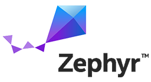

# Zephyr <br><small>Linux 基金会开源、面向物联网应用的实时操作系统</small>

[](https://www.zephyrproject.org/)

## 简介

Zephyr OS 是专门为资源受限设备构建、针对低功耗、小型内存微处理器设备而进行优化的物联网嵌入式小型、可扩展的实时操作系统（RTOS），支持多种硬件架构及多种开发板（包括 ARM Cortex-M, Intel x86, ARC, NIOS II, Tensilica Xtensa, 以及 RISC-V），甚至可以在小至 8kB 内存的系统上运行。

Zephyr 内核相比其他实时操作系统内核具有许多优势：

* **单一地址空间**：应用程序代码和内核代码都在单个共享地址空间中执行。
* **高度可配置**：允许应用程序只包含所需的功能，并指定它们的数量和大小。
* **编译时资源定义**：允许在编译时定义系统资源，从而减少代码大小并提高性能。
* **最小的错误检查**：提供最少的运行时错误检查，以减少代码大小并提高性能。提供了一个可选的错误检查基础结构来帮助在应用程序开发过程中进行调试。
* **广泛的服务套件**：为软件开发提供多种服务，如多线程服务、中断服务、线程间的同步服务、线程间的数据传递服务、电源管理服务。

了解更多细节，可以访问 [Zephyr Project](https://www.zephyrproject.org/) 官网。

## 快速入门

### 克隆 Zephyr 源码

Zephyr OS 源码已经托管在 GitHub 上，可以直接克隆使用：

``` sh
$ git clone https://github.com/zephyrproject-rtos/zephyr.git
```


### 搭建开发环境

Zephyr 项目使用 [CMake](https://cmake.org/) 工具管理和编译项目。 CMake 可以用来生成编译文件，然后使用 `make` 或 `ninja` 进行编译，这是比较常规的做法。下面会针对不同操作系统进行介绍：

* [Windows](#windows)
* [macOS](#macos)
* [Linux](#linux)

#### Windows

在 Windows 上最简单的方法是使用 [Chocolatey](https://chocolatey.org/) 包管理器来安装构建工具：

1. 按照[官方指引]([Chocolatey install](https://chocolatey.org/install))安装 Chocolatey；

2. 以管理员运行命令行工具(`cmd.exe`)；

3. 运行以下命令，在安装软件时可以无须确认：

	``` sh
	$ choco feature enable -n allowGlobalConfirmation
	```

4. 安装 Cmake：

    ``` sh
    $ choco install cmake --installargs 'ADD_CMAKE_TO_PATH=System'
    ```

5. 安装其他必要工具：
    
    ``` sh
    $ choco install git python ninja dtc-msys2 gperf
    ```

6. 关闭 cmd.exe，以普通用户重新打开，并安装 Python 模块：
    
    ``` sh
	$ cd ./zephyr
	$ pip install --user -r scripts/requirements.txt
	$ pip2 install --user -r scripts/py2-requirements.txt
	```

7. 下载并安装 [GNU Arm Embedded Toolchain](https://developer.arm.com/open-source/gnu-toolchain/gnu-rm/downloads)，可以按照到 `c:\gccarmemb`。

8. 设置 Zephyr 环境变量：

	``` sh
	$ set ZEPHYR_TOOLCHAIN_VARIANT=gccarmemb
	$ set GCCARMEMB_TOOLCHAIN_PATH=c:\gccarmemb
	```

#### macOS

在 macOS，使用 [Homebrew](http://brew.sh/) 包管理器可以非常方便的安装所有依赖工具，按照官方最新指引即可完成安装。

Homebrew 成功安装后，运行以下命令安装所需的工具：

``` sh
$ brew install cmake ninja dfu-util doxygen qemu dtc python3 gperf
$ curl -O 'https://bootstrap.pypa.io/get-pip.py'
$ ./get-pip.py
$ rm get-pip.py
$ cd ~/zephyr   # or to the folder where you cloned the zephyr repo
$ pip3 install --user -r scripts/requirements.txt
$ pip2 install --user -r scripts/py2-requirements.txt
```

然后，下载并安装 [GNU Arm Embedded Toolchain](https://developer.arm.com/open-source/gnu-toolchain/gnu-rm/downloads)，确保将其添加到系统变量中：

``` sh
# 将以下脚本添加到 ~/.bash_profile 
export GCCARMEMB_TOOLCHAIN_PATH="<path to install directory>/gcc-arm-none-eabi-6-2017-q2-update"
export ZEPHYR_GCC_VARIANT=gccarmemb
```

#### Linux

对于 Linux 系统，这里 Ubuntu 16.04 为例，先更新系统：

``` sh
$ sudo apt-get update
$ sudo apt-get upgrade
```

然后安装所需的工具：

``` sh
$ sudo apt-get install --no-install-recommends git cmake ninja-build gperf \
  ccache doxygen dfu-util device-tree-compiler \
  python3-ply python3-pip python3-setuptools xz-utils file make gcc-multilib \
  autoconf automake libtool
```

安装 Zephyr 需要的软件包：

``` sh
$ cd ~/zephyr  # or to your directory where zephyr is cloned
$ pip3 install --user -r scripts/requirements.txt
$ pip2 install --user -r scripts/py2-requirements.txt
```

下载并安装 [GNU Arm Embedded Toolchain](https://developer.arm.com/open-source/gnu-toolchain/gnu-rm/downloads)，确保将其添加到系统变量中：

``` sh
# 将以下脚本添加到 ~/.bash_profile 
export GCCARMEMB_TOOLCHAIN_PATH="<path to install directory>/gcc-arm-none-eabi-6-2017-q2-update"
export ZEPHYR_GCC_VARIANT=gccarmemb
```


### 添加 nRF52832-MDK 支持

为了让 Zephyr OS 支持 nRF52832-MDK 板子，需要添加一些配置文件，目录结构如下：

``` sh
.zephyr/boards/arm/nrf52832_mdk
├── Kconfig
├── Kconfig.board
├── Kconfig.defconfig
├── board.cmake
├── board.h
├── nrf52832_mdk.dts
├── nrf52832_mdk.yaml
└── nrf52832_mdk_defconfig
```

如果不想手动创建，你也可以直接从 [makerdiary/zephyr](https://github.com/makerdiary/zephyr) 拉取这些配置文件：


``` sh
$ cd <zephyr git clone location>
$ git remote add makerdiary https://github.com/makerdiary/zephyr.git
$ git pull makerdiary master
```

## 编译运行第一个示例

完成上述准备工作便可以开始编译第一个示例了，这里为了简单起见，以 `hello_world` 为例：

运行以下命令设置 Zephyr 环境变量：

``` sh
$ unset ZEPHYR_SDK_INSTALL_DIR
$ cd <zephyr git clone location>
$ source zephyr-env.sh
```

在 `hello_world` 目录创建 `build` 目录，运行以下命令编译并完成下载：

``` sh
$ cd nrf52832-mdk/examples/zephyr/hello_world/
$ mkdir build && cd build

build$ cmake -GNinja -DBOARD=nrf52832_mdk ..
build$ ninja
build$ ninja flash
```


打开串口工具，可以看到以下信息输出：

``` sh
***** Booting Zephyr OS 1.12.0-rc3 *****
Hello World! arm
```

完成以上示例后，你也可以尝试 `nrf52832-mdk/examples/zephyr/` 目录下的其他例子。

## 更多示例

随着 Zephyr 功能不断丰富，我们会不断增加一些新的应用示例到 [nrf52832-mdk](https://github.com/makerdiary/nrf52832-mdk) 仓库，敬请关注！

## 参考资源

* [Zephyr Project 官网](https://www.zephyrproject.org/)
* [Zephyr Project 文档中心](http://docs.zephyrproject.org/index.html)
* [zephyrproject-rtos/zephyr 仓库](https://github.com/zephyrproject-rtos/zephyr)

## 问题反馈

如果在开发过程遇到任何问题，可以通过 [GitHub Issue](https://github.com/makerdiary/nrf52832-mdk/issues) 反馈。

<a href="https://github.com/makerdiary/nrf52832-mdk/issues/new"><button data-md-color-primary="marsala"><i class="fa fa-github"></i> 创建 Issue</button></a>

