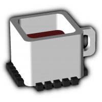
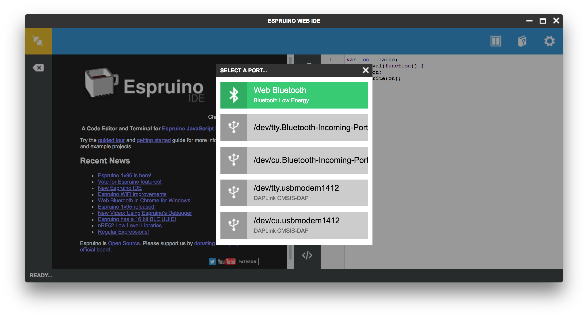
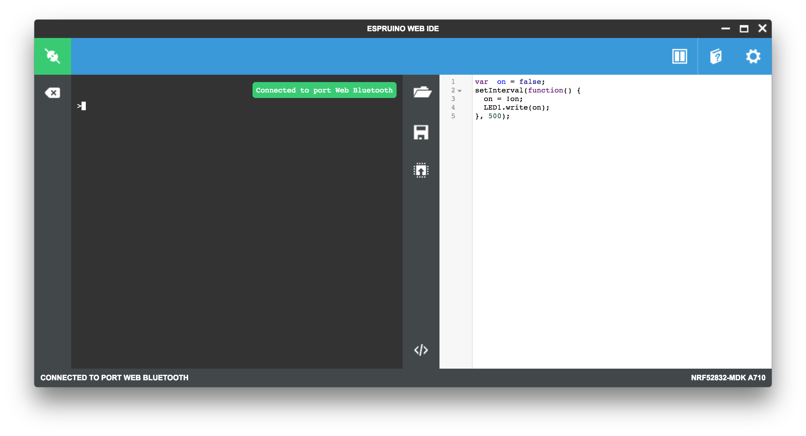
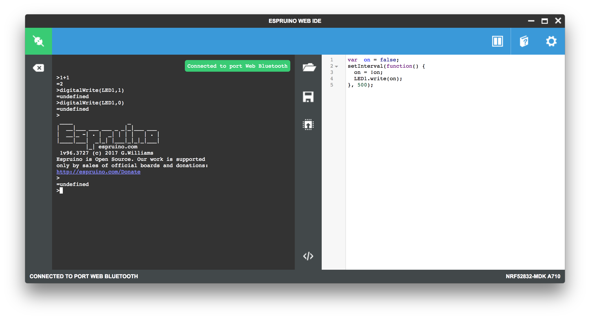
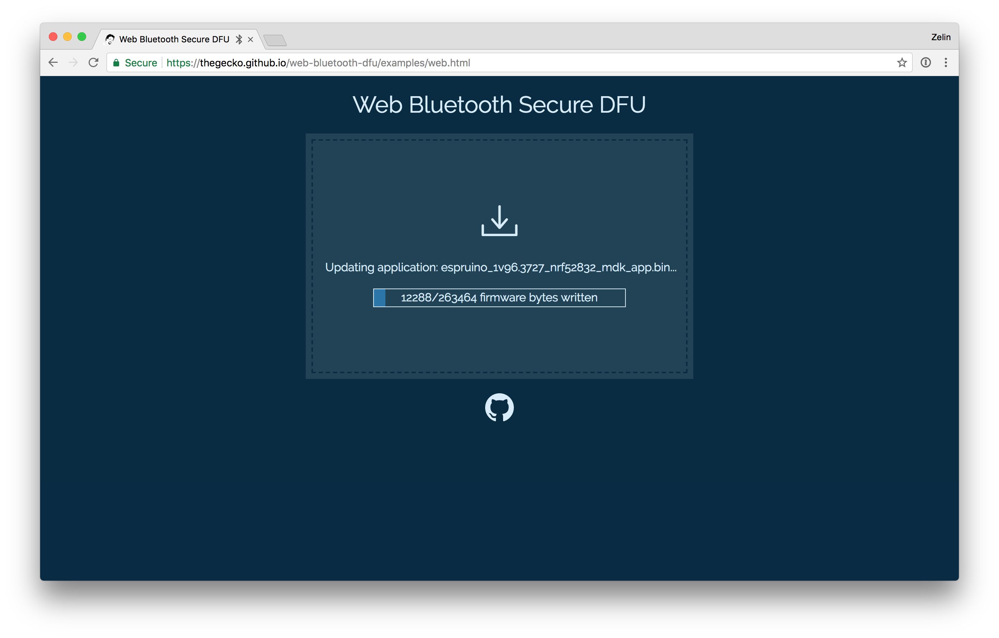

# Espruino<br><small>A JavaScript interpreter for microcontrollers. It is designed for devices with as little as 128kB Flash and 8kB RAM.</small>

[](https://github.com/espruino/Espruino)

## Introduction

[Espruino](https://github.com/espruino/Espruino) is a JavaScript interpreter for microcontrollers. It is designed for devices with as little as 128kB Flash and 8kB RAM.

Unlike other boards that run JavaScript, Espruino fits everything it needs into single chip. This makes it affordable, reliable, and power efficient - allowing it to run for years on a battery.

Espruino plugs in to your computer by USB and appears as a serial device. No drivers, and no special software. Just run a terminal application and start writing code right away!

Espruino comes with its own IDE which installs in seconds and provides a modern Syntax Highlighted editor with code completion. It even automatically loads any modules you need from the internet.

The optional graphical editor makes it quick and easy to create simple devices, even if you've never programmed before.


For more information, please visit [Espruino Official site](http://www.espruino.com/).

## Getting Started

This section will show you how to getting started with Espruino using the nRF52832-MDK board. The instructions are provided for macOS. The steps should be similar for other platforms. 

Ready? Let's start!

### Flashing Espruino

Before we begin coding, we need to program the board with the Espruino firmware. You can get the latest Espruino firmware with the name `espruino_x.x_nrf52832_mdk.hex` in the directory `./nrf52832-mdk/firmware/espruino/`.

Connect the nRF52832-MDK to one of your PC's USB host ports. Then drag and drop the hex file into the **DAPLINK** removable drive.

When programming is completed, the unit will be re-detected by the computer. Espruino will run after pressing the RESET button.


### Installing Espruino Web IDE

We recommend that you use the Chrome Web App. It has a bunch of extra features, including graphical editor. You can do so by performing the following steps:

1. Install the [Chrome Web Browser](https://www.google.com/intl/en/chrome/) if you don't have one.

2. [Click here to get the Espruino Web IDE](https://chrome.google.com/webstore/detail/espruino-web-ide/bleoifhkdalbjfbobjackfdifdneehpo) and click `+FREE` in the top right to install it.

3. Run Espruino Web IDE from Chrome's home screen (or the App Launcher)

### Connecting your board

Now you can connect your board with the Espruino Web IDE. 

Click the **Connect/Disconnect** icon in the top left.

Choose **Web Bluetooth** if your PC has *Bluetooth low energy* supported, or choose serial port connection(For example, `/dev/tty.usbmodem1412`):



For *Web Bluetooth* connection, you should pair the device next:


After that, it will show the board is connected:

 

### Writing & Running your code

Try typing the following in the left-hand side of the Web IDE, and press <kbd>Enter</kbd> after it:

``` sh
> 1+1

> digitalWrite(LED1,1)

> digitalWrite(LED1,0)
```

You can also write your code in the right-hand side of the Web IDE. Will use the `blinky` example here to keep it simple.

``` javascript
var  on = false;
setInterval(function() {
  on = !on;
  LED1.write(on);
}, 500);
```

Click the **Upload** icon to run the example on your board. Observe that the GREEN LED is blinking.



That's it. Now you've got an idea of how to use Espruino.

## How to update Espruino firmware

Over time, more features will be added to the Espruino firmware. You may want to update the latest firmware. This section will show how to update the latest firmware by the following options:

* [Drag-n-drop Programming](#drag-n-drop-programming)
* [Using Web Bluetooth Secure DFU](#using-web-bluetooth-secure-dfu)

### Drag-n-drop Programming

The latest firmware is located in the directory `firmware/espruino/` of the repository [nrf52832-mdk](https://github.com/makerdiary/nrf52832-mdk). For example, `espruino_1v96.3727_nrf52832_mdk.hex`.

Connect the nRF52832-MDK to one of your PC's USB host ports. Then drag and drop the hex file into the **DAPLINK** removable drive.

When programming is completed, the unit will be re-detected by the computer. Espruino will run after pressing the RESET button.


### Using Web Bluetooth Secure DFU

The released firmwares support *Bluetooth Secure DFU* feature. If your PC has *Bluetooth low energy* supported, you can update the firmware by performing the following steps:

1. Start Chrome Web Browser, go to the page: [Web Bluetooth Secure DFU](https://thegecko.github.io/web-bluetooth-dfu/examples/web.html).

2. Wire `P18` to `3V3`, and the power up your board. Observe that the BLUE and RED LEDs are on. Remove the wire, observe that the BLUE is on. It shows that the board is at DFU mode.

3. Choose the firmware package or drag it to the page. The latest firmware package is located in [nrf52832-mdk/firmware/espruino/](https://github.com/makerdiary/nrf52832-mdk/tree/master/firmware/espruino) with the name `espruino_x.x_nrf52832_mdk.zip`.

4. Select the device with the name `DfuTarg` and pair it. Observe that the RED is on, showing that it's uploading. Waiting update complete.



## How to build Espruino

This section will show you how to build your own Espruino firmware.

### Setting up the development environment

The GNU Arm Embedded toolchains is needed to build Espruino.

Download and install the GNU Arm Embedded toolchains. Then make sure to add the path to your toolchain to your OS PATH environment variable:

``` sh
<path to install directory>/gcc-arm-none-eabi-6-2017-q1-update/bin
```

Adding the path makes it possible to run the toolchain executables from any directory using the terminal. To verify that the path is set correctly, type the following in your terminal:

``` sh
$ arm-none-eabi-gcc --version
```

!!! note 
    The latest version of GNU Arm Embedded toolchain maybe not work fine, but you can just have a try.

### Adding support for nRF52832-MDK

Clone the official repository from [Espruino](https://github.com/espruino/Espruino):

``` sh
$ git clone https://github.com/espruino/Espruino.git
```

To add support for nRF52832-MDK, you must create a support file with the name `NRF52832_MDK.py`. This file must be located in a directory in the `./Espruino/boards/` path.

``` python
import pinutils;

info = {
 'name' : "nRF52832-MDK",
 'link' :  [ "https://wiki.makerdiary.com/nrf52832-mdk/" ],
  # This is the nRF52832-MDK
 'default_console' : "EV_SERIAL1",
 'default_console_tx' : "D20",
 'default_console_rx' : "D19",
 'default_console_baudrate' : "9600",
 'variables' : 2250, # How many variables are allocated for Espruino to use. RAM will be overflowed if this number is too high and code won't compile.
 'bootloader' : 1,
 'binary_name' : 'espruino_%v_nrf52832_mdk.hex',
 'build' : {
   'optimizeflags' : '-Os',
   'libraries' : [
     'BLUETOOTH',
     'NET',
     'GRAPHICS',
     'CRYPTO',
     'NFC',
     'NEOPIXEL'
   ],
   'makefile' : [
     'DEFINES+=-DHAL_NFC_ENGINEERING_BC_FTPAN_WORKAROUND=1', # Looks like proper production nRF52s had this issue
     'DEFINES+=-DCONFIG_GPIO_AS_PINRESET', # Allow the reset pin to work
     'DEFINES+=-DBLUETOOTH_NAME_PREFIX=\'"nRF52832-MDK"\'',
     'DFU_PRIVATE_KEY=targets/nrf5x_dfu/dfu_private_key.pem',
     'DFU_SETTINGS=--application-version 0xff --hw-version 52 --sd-req 0x8C'
   ]
 }
};

chip = {
  'part' : "NRF52832",
  'family' : "NRF52",
  'package' : "QFN48",
  'ram' : 64,
  'flash' : 512,
  'speed' : 64,
  'usart' : 1,
  'spi' : 3,
  'i2c' : 2,
  'adc' : 1,
  'dac' : 0,
  'saved_code' : {
    'address' : ((118 - 10) * 4096), # Bootloader takes pages 120-127, FS takes 118-119
    'page_size' : 4096,
    'pages' : 10,
    'flash_available' : 512 - ((31 + 8 + 2 + 10)*4) # Softdevice uses 31 pages of flash, bootloader 8, FS 2, code 10. Each page is 4 kb.
  },
};

devices = {
  'BTN1' : { 'pin' : 'D18', 'pinstate' : 'IN_PULLDOWN' }, # Pin negated in software
  'LED1' : { 'pin' : 'D22', 'inverted' : False }, # Pin negated in software
  'LED2' : { 'pin' : 'D23', 'inverted' : False }, # Pin negated in software
  'LED3' : { 'pin' : 'D24', 'inverted' : False }, # Pin negated in software
  'RX_PIN_NUMBER' : { 'pin' : 'D19'},
  'TX_PIN_NUMBER' : { 'pin' : 'D20'},
  'CTS_PIN_NUMBER' : { 'pin' : 'D7'},
  'RTS_PIN_NUMBER' : { 'pin' : 'D5'},
  # Pin D22 is used for clock when driving neopixels - as not specifying a pin seems to break things
};

# left-right, or top-bottom order
board = {
  'left' : [ 'VIN', '5V', 'GND', 'PD4','PD5','PD6','PD7','PD8','PD9','PD10','PD11','PD12','PD13','PD14','PD15','PD16','PD17','PD18'],
  'right' : [ '3V3', 'GND', 'RST', 'CLK', 'DIO','TDO','TDI', 'TXD','RXD','PD3','PD2','PD31','PD30','PD29','PD28','PD27','PD26','PD25'],
};
board["_css"] = """
""";

def get_pins():
  pins = pinutils.generate_pins(0,31) # 32 General Purpose I/O Pins.
  pinutils.findpin(pins, "PD0", True)["functions"]["XL1"]=0;
  pinutils.findpin(pins, "PD1", True)["functions"]["XL2"]=0;
  pinutils.findpin(pins, "PD5", True)["functions"]["3.3"]=0;
  pinutils.findpin(pins, "PD6", True)["functions"]["3.3"]=0;
  pinutils.findpin(pins, "PD7", True)["functions"]["3.3"]=0;
  pinutils.findpin(pins, "PD8", True)["functions"]["3.3"]=0;
  pinutils.findpin(pins, "PD9", True)["functions"]["NFC1"]=0;
  pinutils.findpin(pins, "PD10", True)["functions"]["NFC2"]=0;
  pinutils.findpin(pins, "PD13", True)["functions"]["3.3"]=0;
  pinutils.findpin(pins, "PD14", True)["functions"]["3.3"]=0;
  pinutils.findpin(pins, "PD15", True)["functions"]["3.3"]=0;
  pinutils.findpin(pins, "PD16", True)["functions"]["3.3"]=0;
  pinutils.findpin(pins, "PD17", True)["functions"]["3.3"]=0;
  pinutils.findpin(pins, "PD18", True)["functions"]["3.3"]=0;
  pinutils.findpin(pins, "PD19", True)["functions"]["RXD"]=0;
  pinutils.findpin(pins, "PD20", True)["functions"]["TXD"]=0;
  pinutils.findpin(pins, "PD22", True)["functions"]["LED_1"]=0;
  pinutils.findpin(pins, "PD23", True)["functions"]["LED_2"]=0;
  pinutils.findpin(pins, "PD24", True)["functions"]["LED_3"]=0;
  pinutils.findpin(pins, "PD2", True)["functions"]["ADC1_IN0"]=0;
  pinutils.findpin(pins, "PD3", True)["functions"]["ADC1_IN1"]=0;
  pinutils.findpin(pins, "PD4", True)["functions"]["ADC1_IN2"]=0;
  pinutils.findpin(pins, "PD5", True)["functions"]["ADC1_IN3"]=0;
  pinutils.findpin(pins, "PD28", True)["functions"]["ADC1_IN4"]=0;
  pinutils.findpin(pins, "PD29", True)["functions"]["ADC1_IN5"]=0;
  pinutils.findpin(pins, "PD30", True)["functions"]["ADC1_IN6"]=0;
  pinutils.findpin(pins, "PD31", True)["functions"]["ADC1_IN7"]=0;
  # everything is non-5v tolerant
  for pin in pins:
    pin["functions"]["3.3"]=0;
  #The boot/reset button will function as a reset button in normal operation. Pin reset on PD21 needs to be enabled on the nRF52832 device for this to work.
  return pins
```


As an option, you can just clone my repository forked from the official. I have added support for nRF52832-MDK.

``` sh
$ git clone https://github.com/makerdiary/Espruino.git
```

### Building Espruino firmware

Now you can try to build the Espruino firmware using the following options:

Open terminal and change directory to:

``` sh
$ cd <Espruino git clone location>/Espruino
```

Build everything, you will get a `.hex` file:

``` sh
$ make clean && BOARD=NRF52832_MDK RELEASE=1 make
```

Build DFU firmware package, you will get a `.zip` file:

``` sh
$ make clean && DFU_UPDATE_BUILD=1 BOARD=NRF52832_MDK RELEASE=1 make
```

Now you can program your board by following the section: [How to update Espruino firmware](#how-to-update-espruino-firmware).

## Reference

* [Espruino Official site](http://www.espruino.com/)
* [Espruino API Reference](http://www.espruino.com/Reference#software)
* [Espruino Modules](http://www.espruino.com/Modules)
* [Espruino Official Repo](https://github.com/espruino/Espruino)
* [Espruino forked by makerdiary](https://github.com/makerdiary/Espruino)

## Create an Issue

Interested in contributing to this project? Want to report a bug? Feel free and click here:

<a href="https://github.com/makerdiary/nrf52832-mdk/issues/new"><button data-md-color-primary="marsala"><i class="fa fa-github"></i> Create an Issue</button></a>

