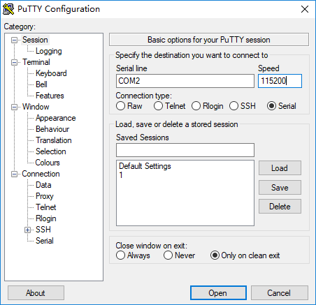
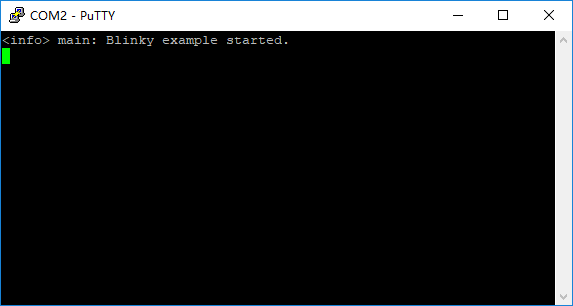
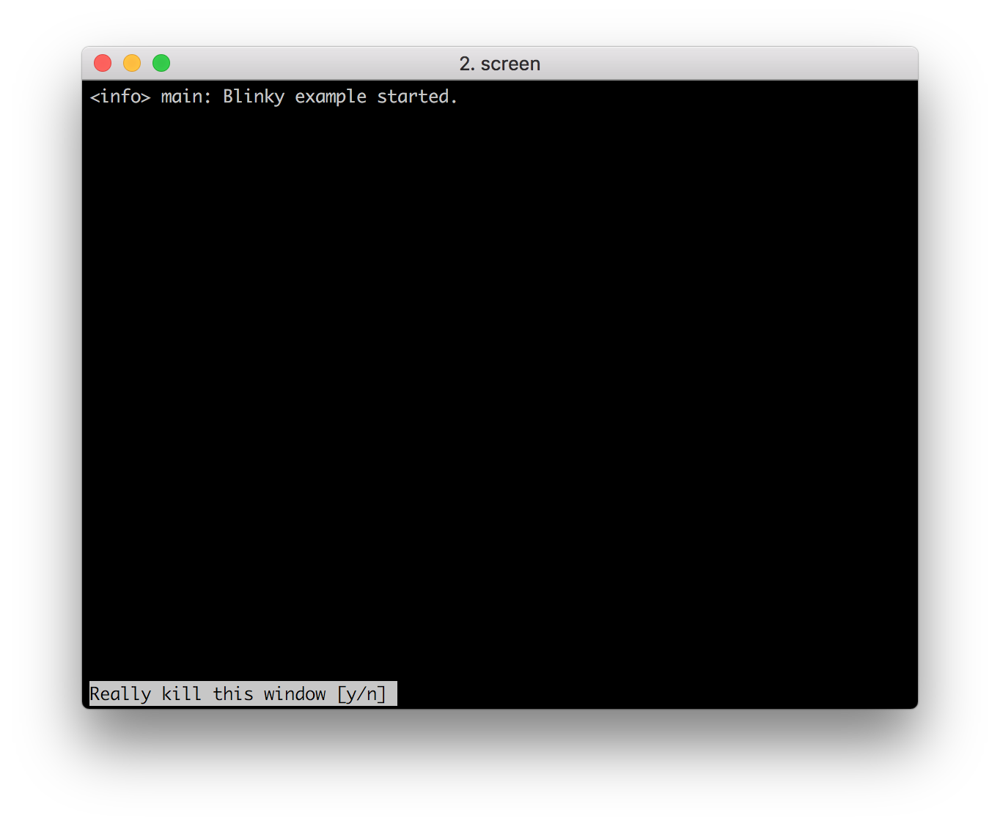
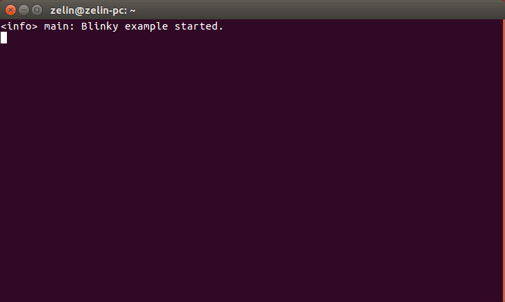
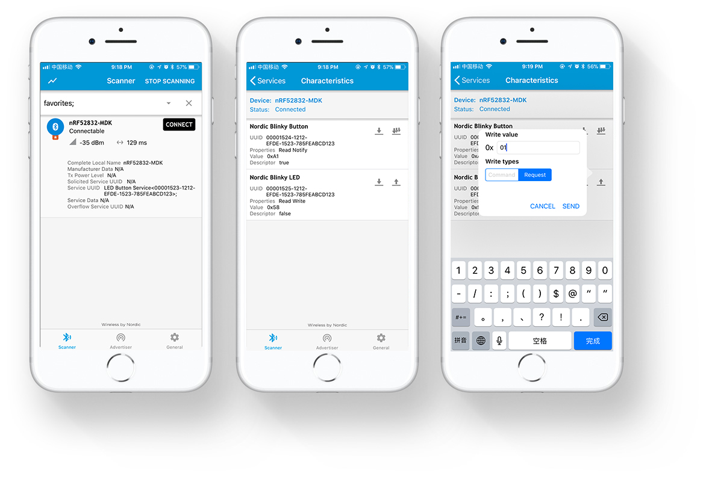
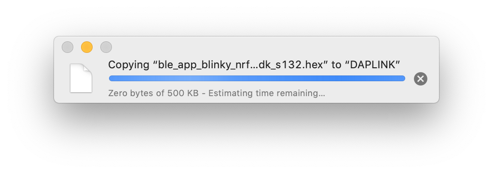
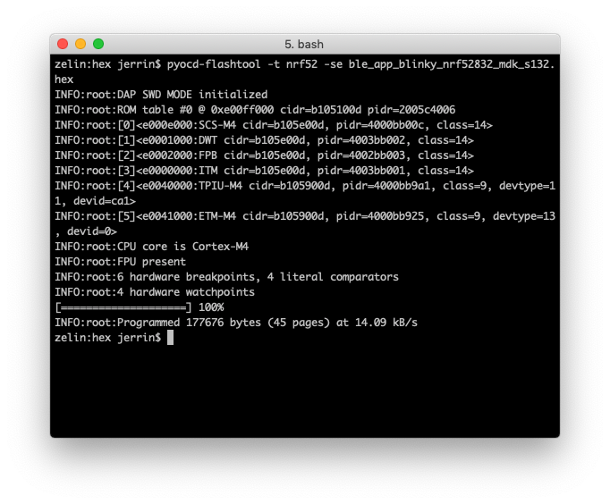

# Getting started with the nRF52832-MDK Board

!!! success "Congratulations on getting the nRF52832-MDK!"
    On this page we'll show you how to connect and power up your nRF52832-MDK, and what to expect when you do so. This will take about 20 minutes.

## Connecting the board

!!! note
    You need a reasonably current Mac/Linux/Windows PC and a mobile phone to perform the following.

You can connect the board by performing the following steps:

 1. Connect the nRF52832-MDK to one of your PC's USB host ports. This provides power to the board. Observe that two GREEN LEDs are on. One indicates that 3.3V power is good, and another indicates that the application is advertising.

 2. Open a file explorer. Confirm that the nRF52832-MDK has appeared as a removable drive named **DAPLINK**. This allows you to program the onboard chip. You'll do this under "[how to program nRF52832-MDK](#how-to-program-nrf52832-mdk)" below.


## Using terminal applications

Terminal applications (for example [PuTTY](https://www.chiark.greenend.org.uk/~sgtatham/putty/) or [screen](https://www.gnu.org/software/screen/manual/screen.html)) run on your host PC. They provide a window where your board can print messages.

You can connect your board to your computer over USB. This should work out of the box on Linux and macOS, but for Windows earlier than Windows 10, you will probably need to install a serial port driver:

1. Download the [Arm Mbed Windows serial port driver](http://os.mbed.com/media/downloads/drivers/mbedWinSerial_16466.exe).

2. Plug in your board over USB. It mounts as a drive.

3. Close all Explorer windows showing the drive.

4. Run the installer. This may take some time or display a few "unsigned driver" warnings.

!!! info "Serial configuration"
    The default setup for the USB serial port is 115200 baud, 8 bits, 1 stop bit, no parity (115200-8-N-1)

### On Windows

There are many terminal applications for Windows, [PuTTY](https://www.chiark.greenend.org.uk/~sgtatham/putty/) is recommended.

Start PuTTY and open the used COM port with the following configuration. If there is nothing printed, just press RESET button on the board.





### On macOS

[screen](https://www.gnu.org/software/screen/manual/screen.html) should work on macOS. In Terminal, run:

``` sh
$ screen /dev/cu.usbmodem1412 115200
```

If there is nothing printed, just press RESET button on the board.

!!! tip
    You can type `screen /dev/cu.usb` first, and then press <kbd>tab</kbd>. The device name will autocomplete.

    To end a screen session, type <kbd>Ctrl</kbd> + <kbd>A</kbd>, and then <kbd>Ctrl</kbd> + <kbd>K</kbd>. At the bottom of the Terminal window, you should see a `[y/n]` prompt. Type <kbd>y</kbd>.



### On Linux

[screen](https://www.gnu.org/software/screen/manual/screen.html) should work on Linux. If for some reason it doesn't, you can try one of the following:

* [CoolTerm](http://freeware.the-meiers.org/)

* [Minicom](https://help.ubuntu.com/community/Minicom)

Here we will use screen on Ubuntu 16.04 for example. If there is nothing printed, just press RESET button on the board.

``` sh
$ sudo apt-get install screen
```

``` sh
$ sudo screen /dev/ttyACM0 115200
```




## Using nRF Connect

You can also test the application with nRF Connect by performing the following steps:

1. Get the **nRF Connect** app from App Store or Google Play.

2. Connect to the device from nRF Connect (the device is advertising as **nRF52832-MDK**).

3. Observe that BLUE LED is on and GREEN LED is off. This indicates that the connections is established.

4. Observe that the services are shown in the connected device.

5. Write `01` to the *Nordic Blinky LED* Characteristic (0x1525) and observe that RED LED is turned on.

6. Write `00` to the *Nordic Blinky LED* Characteristic (0x1525) and observe that RED LED is turned off.




## How to program nRF52832-MDK

You have the following two options to program your nRF52832-MDK: 

* [Drag-n-drop Programming](#drag-n-drop-programming)

* [Using pyOCD](#using-pyocd).

<a href="https://github.com/makerdiary/nrf52832-mdk/tree/master/examples/nrf5-sdk/ble_app_blinky/hex"><button data-md-color-primary="indigo">Get the firmware</button></a>

### Drag-n-drop Programming

Drag and drop the hex file into the **DAPLINK** removable drive mentioned above. The file contains firmware which will be automatically programmed onto the nRF52832 SoC. This happens immediately. The explorer window may close when programming starts. When programming is completed, the unit will be re-detected by the computer. The application will run after pressing the RESET button.

It's so easy, right?



### Using pyOCD

pyOCD is an Open Source python 2.7 based library for programming and debugging ARM Cortex-M microcontrollers using CMSIS-DAP. Linux, OSX and Windows are supported.

The latest stable version of pyOCD may be done via [pip](https://pip.pypa.io/en/stable/index.html) as follows:

``` sh
$ pip install --pre -U pyocd
```

Alternatively, to install the latest development version (master branch), you can do the following:

``` sh
$ pip install --pre -U https://github.com/mbedmicro/pyOCD/archive/master.zip
```

!!! note
    You may run into permissions issues running these commands. You have a few options here:

    * Run with `sudo -H` to install pyOCD and dependencies globally
    * Specify the `--user` option to install local to your user
    * Run the command in a [virtualenv](https://virtualenv.pypa.io/en/latest/) local to a specific project working set.


You can verify that your board is detected by pyOCD by running:

``` sh
$ pyocd-flashtool -l
```

and then flash the board by running:

``` sh
$ pyocd-flashtool -d debug -t nrf52 -se your-hex-file.hex
```




## Clone the repository 

Clone the `makerdiary/nrf52832-mdk` repository or download it as a zip package and put its contents to your working directory.

``` sh
$ git clone https://github.com/makerdiary/nrf52832-mdk.git
```

This repository provides documents and example applications that you can run on your nRF52832-MDK to ensure that everything is set up correctly.

Enjoy!

## Any Issue ?

Interested in contributing to this project? Want to report a bug? Feel free and click here:

<a href="https://github.com/makerdiary/nrf52832-mdk/issues/new"><button data-md-color-primary="indigo"><i class="fa fa-github"></i> New Issue</button></a>

<a href="https://join.slack.com/t/makerdiary/shared_invite/enQtMzIxNTA4MjkwMjc2LTM5MzcyNDhjYjI3YjEwOWE1YzM3YmE0YWEzNGNkNDU3NmE5M2M0MWYyM2QzZTFkNzQ2YjdmMWJlZjIwYmQwMDk"><button data-md-color-primary="red"><i class="fa fa-slack"></i> Add to Slack</button></a>


