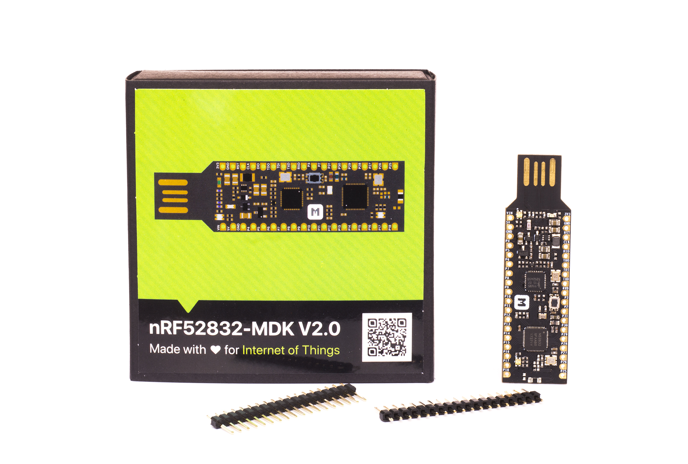
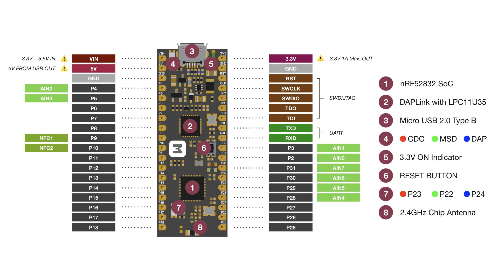
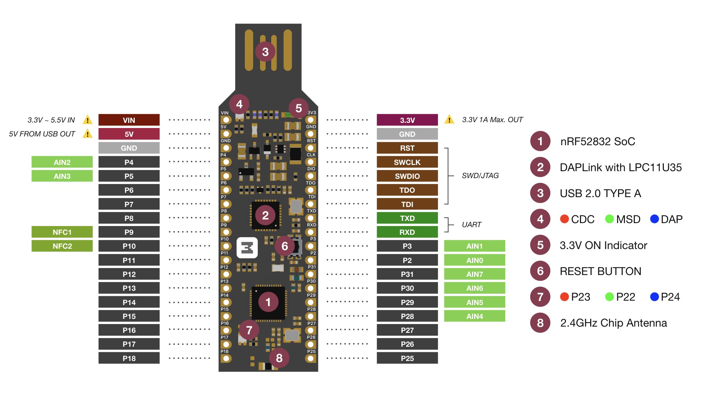
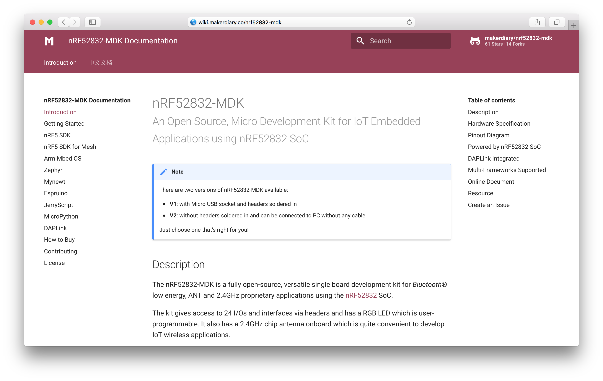

# nRF52832-MDK  <small>An Open Source, Micro Development Kit for IoT Embedded Applications.</small>

!!! note
    There are two versions of nRF52832-MDK available:

    * **V1**: with Micro USB socket and headers soldered in
    
    * **V2**: without headers soldered in and can be connected to PC without any cable

    Just choose one that's right for you!

## Description

The nRF52832-MDK is a fully open-source, versatile single board development kit for *Bluetooth*® low energy, ANT and 2.4GHz proprietary applications using the [nRF52832](http://www.nordicsemi.com/eng/Products/Bluetooth-low-energy/nRF52832) SoC.

The kit gives access to 24 I/Os and interfaces via headers and has a RGB LED which is user-programmable. It also has a 2.4GHz chip antenna onboard which is quite convenient to develop IoT wireless applications. 

It supports the Nordic offical SDK using GCC, Keil and IAR. Program/Debug options on the kit is [DAPLink](https://github.com/ARMmbed/DAPLink).

The nRF52832-MDK can also be used to play with multi-frameworks such as: nRF5 SDK, nRF5 SDK for Mesh, Mbed OS 5, Zephyr, Mynewt, JerryScript, Espruino, MicroPython, Web Bluetooth, Eddystone, etc.

## Hardware Specification

nRF52832-MDK provides the following hardware features:

* Nordic Semiconductor nRF52832 

	* ARM® Cortex™-M4F
	* 512kB Flash Memory + 64kB RAM
	* Bluetooth low energy, ANT and 2.4GHz
	* NFC™-A tag

* Program/Debug options with DAPLink

	* MSC - drag-n-drop programming flash memory
	* CDC - virtual com port for log, trace and terminal emulation
	* HID - CMSIS-DAP compliant debug channel

* Up to 24 GPIOs at headers

* Reset Button

* RGB LED

* 2.4GHz chip antenna

* 3.3V regulator with 1A peak current output

* VBUS & VIN Power-Path Management

* Breadboard-friendly

* Two dimensions available:

	* V1: 48mm x 18mm x 13mm with headers soldered in
	* V2: 63mm x 18mm x 4mm without headers soldered in

## Pinout

## Powered by nRF52832 SoC

The nRF52832 SoC is a powerful, highly flexible ultra-low power multiprotocol SoC ideally suited for Bluetooth® low energy, ANT and 2.4GHz ultra low-power wireless applications. The nRF52832 SoC is built around a 32-bit ARM® Cortex™-M4F CPU with 512kB + 64kB RAM. The embedded 2.4GHz transceiver supports Bluetooth low energy, ANT and proprietary 2.4 GHz protocol stack. It is on air compatible with the nRF51 Series, nRF24L and nRF24AP Series products from Nordic Semiconductor.

<a href="http://www.nordicsemi.com/eng/Products/Bluetooth-low-energy/nRF52832"><button data-md-color-primary="indigo">More infomation</button></a>

## DAPLink Integrated

Arm Mbed DAPLink is an open-source software project that enables programming and debugging application software on running on Arm Cortex CPUs. Commonly referred to as interface firmware, DAPLink runs on a secondary MCU that is attached to the SWD port of the application MCU. Enumerating as a USB composite device, it creates a bridge between your development computer and the CPU debug access port. DAPLink enables developers with:

* MSC - drag-n-drop programming flash memory
* CDC - virtual com port for log, trace and terminal emulation
* HID - CMSIS-DAP compliant debug channel

<a href="https://github.com/ARMmbed/DAPLink"><button data-md-color-primary="indigo">ARMmbed/DAPLink</button></a>

## Multi-Frameworks Supported

The nRF52832-MDK can be used to play with multi-frameworks such as: *nRF5 SDK*, *nRF5 SDK for Mesh*, *Mbed OS 5*, *Zephyr*, *Mynewt*, *JerryScript*, *Espruino*, *MicroPython*, *Web Bluetooth*, *Eddystone* ....

| Framework  | Brief Description |
| ---------- | ----- |
| [nRF5 SDK](http://www.nordicsemi.com/eng/Products/Bluetooth-low-energy/nRF5-SDK) | Software Development Kit for nRF51 and nRF52 Series |
| [nRF5 SDK for Mesh](http://www.nordicsemi.com/eng/Products/Bluetooth-low-energy/nRF5-SDK-for-Mesh) | Software Development Kit for Bluetooth mesh solutions using nRF51 Series and nRF52 Series |
| [Mbed OS 5](https://os.mbed.com/) | An Open Source Embedded Operating System designed specifically for the "things" in the Internet of Things. |
| [Zephyr](https://www.zephyrproject.org/) | A Small, Scalable Open Source RTOS for IoT Embedded Devices. |
| [Mynewt](https://mynewt.apache.org/) | An OS to build, deploy and securely manage billions of devices. |
| [JerryScript](https://github.com/jerryscript-project/jerryscript) | A Ultra-lightweight JavaScript engine for the Internet of Things. |
| [Espruino](https://github.com/espruino/Espruino) | A JavaScript interpreter for microcontrollers. It is designed for devices with as little as 128kB Flash and 8kB RAM. |
| [MicroPython](https://github.com/micropython/micropython) | A lean and efficient Python implementation for microcontrollers and constrained systems. |
| [Web Bluetooth](https://github.com/WebBluetoothCG/web-bluetooth) | Bluetooth support for the Web. |
| [Eddystone](https://github.com/google/eddystone) | A protocol specification that defines a Bluetooth low energy (BLE) message format for proximity beacon messages. |
| .... | |

## Online Document

The excellent project document is provided with nRF52832-MDK. It's generated by [MkDocs](http://www.mkdocs.org/) and hosted on [GitHub](https://github.com/makerdiary/nrf52832-mdk/).

## Resource

| Releases | Design Files                   |
| -------- | ------------------------------ |
| V2.0     | [nRF52832-MDK V2.0 Schematic](hardware/nRF52832-MDK_SCH_V2.0.pdf) [nRF52832-MDK V2.0 PCB](hardware/nRF52832-MDK_PCB_V2.0.pdf) [nRF52832-MDK V2.0 3D STEP](hardware/nRF52832-MDK_3D_STEP_V2.0.step)|
| V1.1     | [nRF52832-MDK V1.1 Schematic](hardware/nRF52832-MDK_SCH_V1.1.pdf) [nRF52832-MDK V1.1 PCB](hardware/nRF52832-MDK_PCB_V1.1.pdf) [nRF52832-MDK V1.1 3D STEP](hardware/nRF52832-MDK_3D_STEP_V1.1.step)|
| V1.0     | [nRF52832-MDK V1.0 Schematic](hardware/nRF52832-MDK_SCH_V1.0.pdf) [nRF52832-MDK V1.0 PCB](hardware/nRF52832-MDK_PCB_V1.0.pdf) [nRF52832-MDK V1.0 3D STEP](hardware/nRF52832-MDK_3D_STEP_V1.0.step)|

## Any Issue ?

Interested in contributing to this project? Want to report a bug? Feel free and click here:

<a href="https://github.com/makerdiary/nrf52832-mdk/issues/new"><button data-md-color-primary="indigo"><i class="fa fa-github"></i> New Issue</button></a>

<a href="https://join.slack.com/t/makerdiary/shared_invite/enQtMzIxNTA4MjkwMjc2LTM5MzcyNDhjYjI3YjEwOWE1YzM3YmE0YWEzNGNkNDU3NmE5M2M0MWYyM2QzZTFkNzQ2YjdmMWJlZjIwYmQwMDk"><button data-md-color-primary="red"><i class="fa fa-slack"></i> Add to Slack</button></a>

