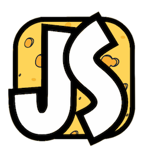
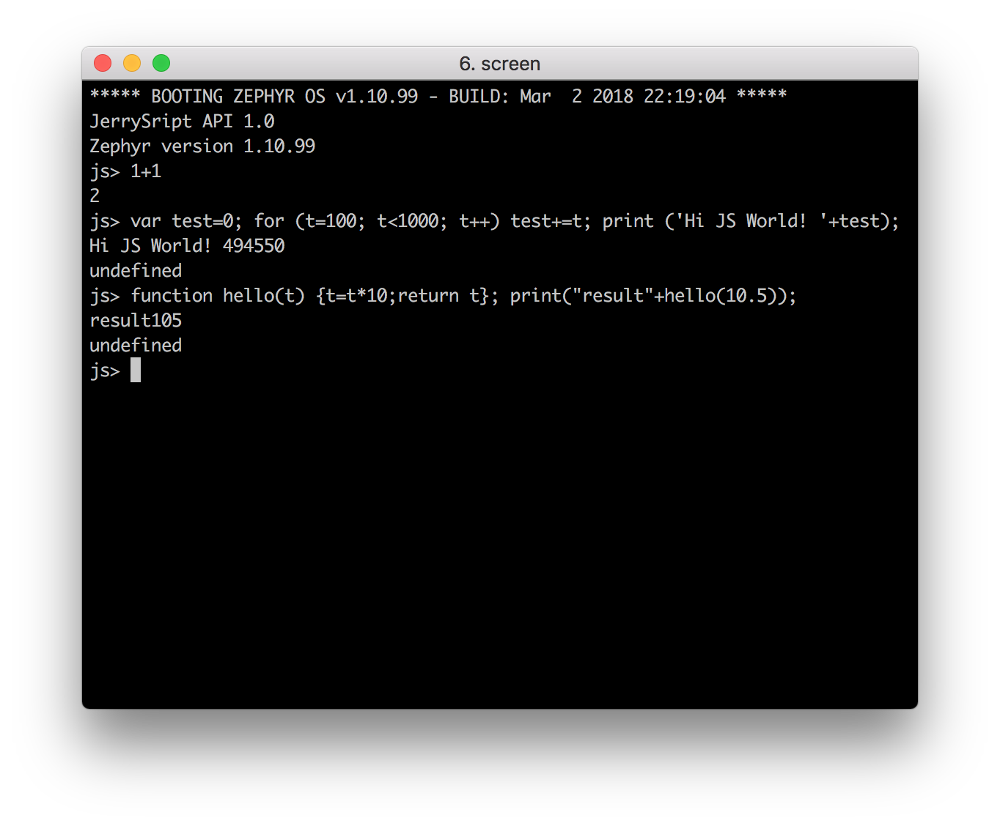

# JerryScript<br><small>A Ultra-lightweight JavaScript engine for <strong>Internet of Things</strong></small>

[](https://github.com/jerryscript-project/jerryscript)

## Introduction

JerryScript is a lightweight JavaScript engine for resource-constrained devices such as microcontrollers. It can run on devices with less than 64 KB of RAM and less than 200 KB of flash memory.

Key characteristics of JerryScript:

* Full ECMAScript 5.1 standard compliance
* 160K binary size when compiled for ARM Thumb-2
* Heavily optimized for low memory consumption
* Written in C99 for maximum portability
* Snapshot support for precompiling JavaScript source code to byte code
* Mature C API, easy to embed in applications

For more information, please visit [JerryScript Official Repo](https://github.com/jerryscript-project/jerryscript).

## Getting Started

### Setting up prerequisites

There are several dependencies, that should be installed manually. The following list is the absolute minimum for building:

* `gcc` or any C99-compliant compiler (native or cross, e.g., arm-none-eabi)
* `cmake` >= `2.8.12.2`

Several scripts and tools help the building and development process, thus it is recommended to have the following installed as well:

* `bash` >= `4.3.11`
* `cppcheck` >= `1.61`
* `vera++` >= `1.2.1`
* `python` >= `2.7.6`

To make the scripts run correctly, several shell utilities should be available on the system:

* `awk`
* `bc`
* `find`
* `sed`

Clone the [jerryscript](https://github.com/jerryscript-project/jerryscript) repository on GitHub or download it as a zip package and put its contents to your working directory.

``` sh
$ git clone https://github.com/jerryscript-project/jerryscript.git
```

### Building JerryScript for Zephyr

Before buiding JerryScript for Zephyr, you need to prepare the Zephyr development environment. 

Follow [this](../zephyr) page to get the Zephyr source and configure the environment.

Remember to source the Zephyr environment as explained in the Zephyr documenation:

``` sh
$ cd zephyr
$ source zephyr-env.sh
```

Build the firmware and program your nRF52832-MDK by running:

``` sh
$ cd jerryscript
$ make -f ./targets/zephyr/Makefile.zephyr BOARD=nrf52832_mdk flash
```

When the programming operation completes, test command line in a serial terminal.

You should see something similar to this:

``` sh
***** BOOTING ZEPHYR OS v1.10.99 - BUILD: Mar  2 2018 22:19:04 *****
JerryScript build: Mar  2 2018 22:19:03
JerryScript API 1.0
Zephyr version 1.10.99
js>
```

Run the example javascript command test function:

``` js
js> var test=0; for (t=100; t<1000; t++) test+=t; print ('Hi JS World! '+test);
Hi JS World! 494550
undefined
```

Try a more complex function:

``` js
js> function hello(t) {t=t*10;return t}; print("result"+hello(10.5));
result105
undefined
```



!!! tip
	This firmware is available in the directory `./nrf52832-mdk/firmware/jerryscript/` with the name `jerryscript_v1.0_for_zephyr.hex`.


## More examples

The implement of JerryScript for nRF5x SoC is **NOT** complete and many hardware APIs need to be added. 

There is an open source project called [Zephyr.js](https://github.com/intel/zephyr.js)(ZJS for short). It provides an IoT web runtime environment with JavaScript APIs for the Zephyr operating system, based on the JerryScript engine.

There is only partial support for modules on nRF52 compared to Zephyr. Many hardware specific module (I2C, GPIO, ADC etc.) is not supported on nRF52.

Over time, more features may be added to ZJS. You can keep watching it for updates.

## Reference

* [JerryScript repo](https://github.com/jerryscript-project/jerryscript)
* [zephyr.js repo](https://github.com/intel/zephyr.js)


## Create an Issue

Interested in contributing to this project? Want to report a bug? Feel free and click here:

<a href="https://github.com/makerdiary/nrf52832-mdk/issues/new"><button data-md-color-primary="marsala"><i class="fa fa-github"></i> Create an Issue</button></a>
